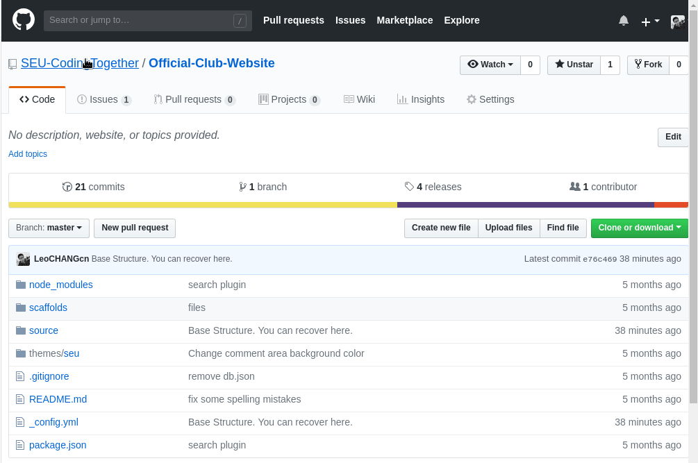

# 招新啦！！！

可爱的同学们，一年一度的招新又开始了！

本次招新分为三个部门：宣传部、组织部、技术部！

相信在微软俱乐部，你一定可以收获自己的精彩！

在微软俱乐部，除了收获小伙伴的友谊，丰富自己的生活，你还以学到好多有用的技术哦！感兴趣的同学可以先睹为快:

[`点击链接`：如何参与GITHUB项目？](https://angryberry.gitee.io/2018/04/06/github1/)

你也可以访问我们的编程组织项目主页：[`链接`：Programming Ninja (SEU-CodingTogether)](https://github.com/SEU-CodingTogether)，只要你有兴趣，提供以下信息，我们即将会在招新结束后，如果您通过审核，我们就会邀请您进入我们的编程小组，共同维护我们的编程项目！

我们不仅仅面向东南大学的学生，如果你是其他高校的学生也没有关系！希望参加活动的同学可以提供个人个人信息，到邮箱`zhangshichaoseu@foxmail.com`，邮件主题注明：`东南大学微软俱乐部2018+姓名+意向项目`，比如：东南大学微软俱乐部2018-小明-daily python，邮件需包含以下内容：

- Github用户名和对应的注册邮箱
- 姓名，学校，专业，年级
- 有意向参加的项目
- 技能介绍（100字左右）
- 我们同样需要高级技术人才为我们的项目代码质量把关，如果您足够自信，可以申请管理者小组。（申请管理小组的同学，具体信息参见[`点击链接`：如何参与GITHUB项目？](https://angryberry.gitee.io/2018/04/06/github1/)）

> 如有问题，欢迎在下方评论区发言询问。如果你的浏览器无法加载评论区，可是试试翻墙、换一个网络或者刷新一下。如果是在无法加载，可以到https://github.com/SEU-CodingTogether/Official-Club-Website的Issue区留下相关信息。
> 
> 

每周最新活动会在本页更新！

